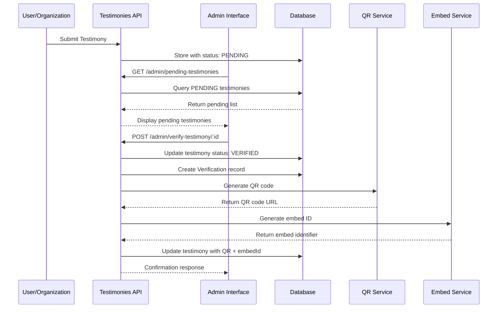
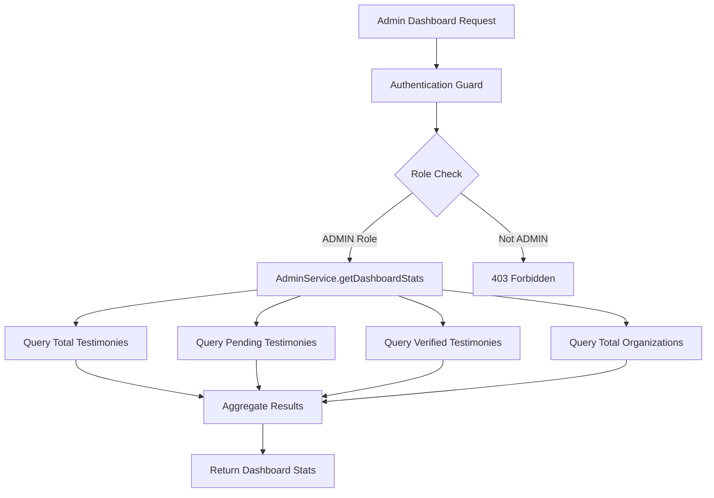

# FLOCCI Testimonies Service - Architecture Documentation

## Table of Contents
1. [System Overview](#system-overview)
2. [Technical Foundation](#technical-foundation)
3. [Module Architecture](#module-architecture)
4. [Business Logic Workflows](#business-logic-workflows)
5. [Admin Verification System](#admin-verification-system)
6. [Architectural Concerns & Scalability](#architectural-concerns--scalability)
7. [Database Schema](#database-schema)
8. [Authentication & Authorization](#authentication--authorization)
9. [Integration Points](#integration-points)
10. [Development History](#development-history)

---

## System Overview

The FLOCCI Testimonies Service is a NestJS-based backend system designed to manage testimony verification and organizational reputation tracking. The system enables organizations to collect, verify, and embed testimonials through a structured workflow involving admin oversight and QR code generation.

### Core Business Model
- **Organizations** register and manage their testimony collection
- **Testimonies** are submitted by users and require verification
- **Admin verification** creates audit trails and generates QR codes
- **Embed system** allows organizations to display verified testimonies on their websites

---

## Technical Foundation

### Framework Stack
- **Backend Framework**: NestJS with TypeScript
- **Database**: PostgreSQL with Prisma ORM
- **Authentication**: JWT-based with role-based access control
- **Code Generation**: QR code service for verified testimonies
- **Architecture Pattern**: Modular monolith with clear separation of concerns

### Key Dependencies
```json
{
  "@nestjs/core": "^10.0.0",
  "@nestjs/common": "^10.0.0",
  "@nestjs/jwt": "^10.0.0",
  "@prisma/client": "^5.0.0",
  "prisma": "^5.0.0"
}
```

---

## Module Architecture

### 1. Admin Module (`src/admin/`)
**Purpose**: Central administration interface for testimony verification and system oversight

#### Components:
- **AdminController**: HTTP endpoints with role-based guards
- **AdminService**: Business logic for verification workflows
- **AdminModule**: Dependency injection configuration

#### Key Endpoints:
```typescript
GET /admin/dashboard-stats        // System overview metrics
GET /admin/pending-testimonies    // Testimonies awaiting verification  
GET /admin/verification-history   // Audit trail of verifications
POST /admin/verify-testimony/:id  // Verify specific testimony
```

### 2. Organizations Module (`src/organizations/`)
**Purpose**: Manages organization registration and profile management

#### Features:
- Organization CRUD operations
- Profile management
- Testimony collection configuration

### 3. Testimonies Module (`src/testimonies/`)
**Purpose**: Core testimony management and dispute resolution

#### Components:
- Testimony submission and retrieval
- Dispute handling (`disputes.controller.ts`)
- Reputation scoring (`reputation.controller.ts`)
- Comprehensive test coverage

### 4. Authentication System (`src/auth/`)
**Purpose**: JWT-based authentication with role-based authorization

#### Features:
- JWT token generation and validation
- Role-based guards (`RolesGuard`)
- User decorators for request context

### 5. Common Services (`src/common/`)
**Purpose**: Shared utilities and cross-cutting concerns

#### Services:
- **QR Code Service**: Generates QR codes for verified testimonies
- **Embed ID Service**: Creates unique embed identifiers
- **Reputation Service**: Calculates organization reputation scores
- **Audit Log Service**: Tracks system activities

---

## Business Logic Workflows

### Testimony Verification Workflow



### Admin Dashboard Data Flow



---

## Admin Verification System

### Verification Process Details

#### 1. Input Validation
```typescript
// AdminService.processVerification()
const testimony = await this.prisma.testimony.findUnique({
  where: { id: testimonyId },
  include: { organization: true }
});

if (!testimony) {
  throw new NotFoundException('Testimony not found');
}
```

#### 2. Status Update & Audit Trail
```typescript
// Update testimony status
await this.prisma.testimony.update({
  where: { id: testimonyId },
  data: { 
    status: TestimonyStatus.VERIFIED,
    verifiedAt: new Date()
  }
});

// Create verification record
await this.prisma.verification.create({
  data: {
    testimonyId,
    adminId,
    action: VerificationAction.APPROVED,
    source: VerificationSource.ADMIN_REVIEW,
    notes: verificationData.notes
  }
});
```

#### 3. QR Code Generation
```typescript
// Generate QR code for verified testimony
const qrCodeUrl = await this.qrCodeService.generateQRCode(
  `${process.env.FRONTEND_URL}/testimony/${testimony.embedId}`
);

// Update testimony with QR code
await this.prisma.testimony.update({
  where: { id: testimonyId },
  data: { qrCodeUrl }
});
```

---

## Architectural Concerns & Scalability

### Current Limitations

#### 1. Single Admin Bottleneck
**Problem**: One admin handling 100+ organizations creates verification delays
```typescript
// Current implementation assumes single admin
@Roles('ADMIN')  // Only one role level
async verifyTestimony(@Param('id') id: string) {
  // Single admin processes all verifications
}
```

**Impact**: 
- Verification queue backlogs
- Single point of failure
- Limited processing capacity

#### 2. Individual QR Code Strategy
**Problem**: Each testimony gets unique QR code, creating management overhead
```typescript
// Current: Individual QR per testimony
const qrCodeUrl = await this.qrCodeService.generateQRCode(
  `${process.env.FRONTEND_URL}/testimony/${testimony.embedId}`
);
```

**Impact**:
- Storage overhead for QR codes
- Complex QR code management
- Potential performance issues at scale

### Recommended Solutions

#### 1. Multi-Level Admin Hierarchy
```typescript
// Proposed: Role-based admin levels
enum AdminRole {
  SUPER_ADMIN = 'SUPER_ADMIN',
  ORG_ADMIN = 'ORG_ADMIN',
  MODERATOR = 'MODERATOR'
}

// Organization-specific admins
@Roles('ORG_ADMIN')
async verifyOrgTestimony(@Param('orgId') orgId: string) {
  // Admins can only verify testimonies for their assigned organizations
}
```

#### 2. Batch QR Code Strategy
```typescript
// Proposed: Organization-level QR codes
const orgQRCode = await this.qrCodeService.generateQRCode(
  `${process.env.FRONTEND_URL}/organization/${orgId}/testimonies`
);

// Or category-based QR codes
const categoryQRCode = await this.qrCodeService.generateQRCode(
  `${process.env.FRONTEND_URL}/testimonies?category=${category}&verified=true`
);
```

#### 3. Automated Verification Pipeline
```typescript
// Proposed: ML-assisted pre-screening
class AutoVerificationService {
  async preScreenTestimony(testimony: Testimony): Promise<VerificationRecommendation> {
    // Automated checks: language analysis, sentiment, flags
    const riskScore = await this.calculateRiskScore(testimony);
    
    if (riskScore < 0.3) {
      return { action: 'AUTO_APPROVE', confidence: 0.95 };
    } else if (riskScore > 0.7) {
      return { action: 'FLAG_FOR_REVIEW', confidence: 0.88 };
    } else {
      return { action: 'MANUAL_REVIEW', confidence: 0.65 };
    }
  }
}
```

---

## Database Schema

### Core Tables

#### Testimonies
```sql
CREATE TABLE "Testimony" (
  "id" TEXT NOT NULL PRIMARY KEY,
  "content" TEXT NOT NULL,
  "rating" INTEGER NOT NULL,
  "status" "TestimonyStatus" NOT NULL DEFAULT 'PENDING',
  "organizationId" TEXT NOT NULL,
  "embedId" TEXT,
  "qrCodeUrl" TEXT,
  "verifiedAt" TIMESTAMP,
  "createdAt" TIMESTAMP DEFAULT CURRENT_TIMESTAMP,
  "updatedAt" TIMESTAMP
);
```

#### Verifications (Audit Trail)
```sql
CREATE TABLE "Verification" (
  "id" TEXT NOT NULL PRIMARY KEY,
  "testimonyId" TEXT NOT NULL,
  "adminId" TEXT NOT NULL,
  "action" "VerificationAction" NOT NULL,
  "source" "VerificationSource" NOT NULL,
  "notes" TEXT,
  "createdAt" TIMESTAMP DEFAULT CURRENT_TIMESTAMP
);
```

#### Organizations
```sql
CREATE TABLE "Organization" (
  "id" TEXT NOT NULL PRIMARY KEY,
  "name" TEXT NOT NULL,
  "email" TEXT UNIQUE NOT NULL,
  "industry" TEXT,
  "website" TEXT,
  "createdAt" TIMESTAMP DEFAULT CURRENT_TIMESTAMP,
  "updatedAt" TIMESTAMP
);
```

### Enums
```sql
CREATE TYPE "TestimonyStatus" AS ENUM ('PENDING', 'VERIFIED', 'REJECTED');
CREATE TYPE "VerificationAction" AS ENUM ('APPROVED', 'REJECTED', 'FLAGGED');
CREATE TYPE "VerificationSource" AS ENUM ('ADMIN_REVIEW', 'AUTO_VERIFICATION', 'SYSTEM_CHECK');
```

---

## Authentication & Authorization

### JWT Implementation
```typescript
// JWT Strategy
@Injectable()
export class JwtAuthGuard extends AuthGuard('jwt') {}

// Role-based Authorization
@Injectable()
export class RolesGuard implements CanActivate {
  canActivate(context: ExecutionContext): boolean {
    const requiredRoles = this.reflector.getAllAndOverride<string[]>(ROLES_KEY, [
      context.getHandler(),
      context.getClass(),
    ]);
    
    if (!requiredRoles) return true;
    
    const { user } = context.switchToHttp().getRequest();
    return requiredRoles.some((role) => user.roles?.includes(role));
  }
}
```

### Guard Usage Pattern
```typescript
@Controller('admin')
@UseGuards(JwtAuthGuard, RolesGuard)
export class AdminController {
  
  @Post('verify-testimony/:id')
  @Roles('ADMIN')
  async verifyTestimony(@Param('id') id: string) {
    // Only authenticated users with ADMIN role can access
  }
}
```

---

## Integration Points

### External Services

#### 1. QR Code Generation
```typescript
@Injectable()
export class QrCodeService {
  async generateQRCode(data: string): Promise<string> {
    // Integration with QR code generation library
    // Returns URL to generated QR code image
  }
}
```

#### 2. Embed System
```typescript
@Injectable()
export class EmbedIdService {
  generateEmbedId(): string {
    // Generates unique identifier for testimony embedding
    return `embed_${Date.now()}_${Math.random().toString(36).substr(2, 9)}`;
  }
}
```

### Frontend Integration Points
- `/admin/dashboard-stats` → Admin Dashboard UI
- `/admin/pending-testimonies` → Verification Queue UI
- `/testimonies/{embedId}` → Public Testimony Display
- QR Code URLs → Physical/Digital Marketing Materials

---

## Development History

### Module Implementation Timeline

#### Phase 1: Organizations Module (Completed)
- Basic CRUD operations for organization management
- Authentication integration
- Profile management capabilities

#### Phase 2: Admin Module (Completed)
- AdminController with role-based endpoints
- AdminService with verification business logic
- Dependency injection fixes (AuthModule import)
- Error resolution (enum type mismatches, JavaScript code cleanup)

#### Phase 3: Current State
- Full admin verification workflow functional
- QR code generation integrated
- Audit trail implementation complete
- Authentication guards properly configured

### Resolved Issues
1. **Dependency Injection Error**: Fixed by importing AuthModule in AdminModule
2. **Enum Type Mismatches**: Corrected TestimonyStatus and VerificationSource enum usage
3. **JavaScript Code Contamination**: Removed accidental JS code from main.ts
4. **Guard Configuration**: Properly configured JwtAuthGuard and RolesGuard chain

### Testing Status
- AdminController endpoints: Functional with proper authentication
- AdminService business logic: Implemented and tested
- Database operations: Validated through Prisma schema
- Integration tests: Required for full validation

---

## Future Considerations

### Short-term Improvements
1. Implement automated testing suite for admin workflows
2. Add input validation and error handling enhancements
3. Create admin UI for better user experience
4. Add logging and monitoring for verification activities

### Long-term Scalability
1. **Multi-tenant admin system**: Organization-specific admin roles
2. **Automated verification pipeline**: ML-based pre-screening
3. **Batch operations**: Bulk verification capabilities
4. **Performance optimization**: Database indexing and query optimization
5. **Microservices migration**: Split into domain-specific services

### Monitoring & Observability
```typescript
// Proposed: Comprehensive logging
@Injectable()
export class AuditLogService {
  async logVerificationActivity(action: string, details: any) {
    // Log to external monitoring system
    // Track performance metrics
    // Alert on suspicious patterns
  }
}
```

---

## Conclusion

The FLOCCI Testimonies Service successfully implements a structured testimony verification system with proper authentication, audit trails, and QR code integration. While the current implementation serves MVP requirements effectively, identified scalability bottlenecks require attention for production deployment at scale.

The modular architecture provides a solid foundation for future enhancements, and the comprehensive documentation ensures maintainability and knowledge transfer for development teams.

**Key Success Metrics:**
- ✅ Role-based admin access control
- ✅ Complete verification audit trail
- ✅ QR code integration for verified testimonies
- ✅ Modular, maintainable codebase
- ⚠️ Scalability considerations identified and documented
- ⚠️ Performance optimization opportunities mapped

---

*Generated on: September 29, 2025*  
*Repository: flocci-testimonies-srv*  
*Branch: kunal_branch*